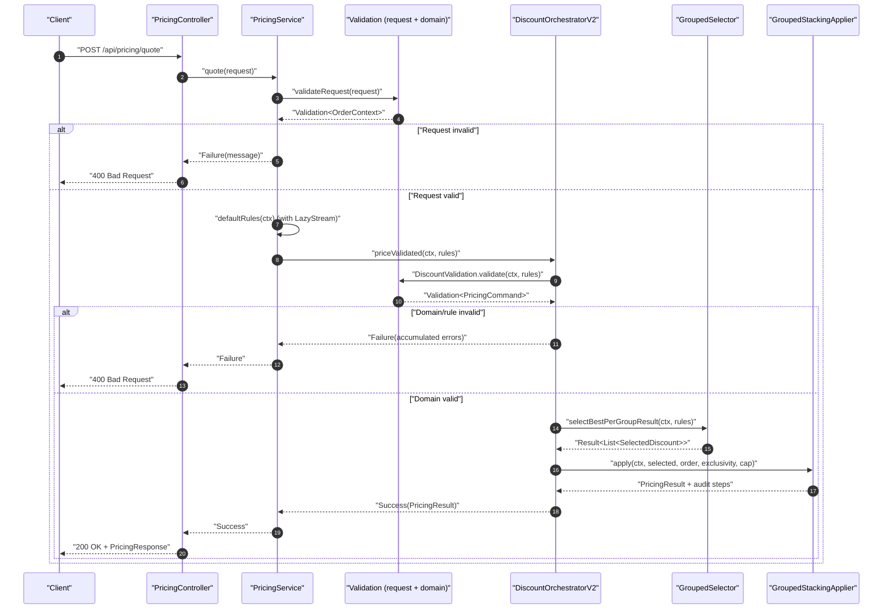

# Pricing Sequence Diagram

```mermaid
sequenceDiagram
    autonumber
    participant C as "Client"
    participant API as "PricingController"
    participant SVC as "PricingService"
    participant VAL as "Validation (request + domain)"
    participant ORCH as "DiscountOrchestratorV2"
    participant SEL as "GroupedSelector"
    participant APP as "GroupedStackingApplier"

    C->>API: "POST /api/pricing/quote"
    API->>SVC: "quote(request)"
    SVC->>VAL: "validateRequest(request)"
    VAL-->>SVC: "Validation<OrderContext>"

    alt "Request invalid"
        SVC-->>API: "Failure(message)"
        API-->>C: "400 Bad Request"
    else "Request valid"
        SVC->>SVC: "defaultRules(ctx) (with LazyStream)"
        SVC->>ORCH: "priceValidated(ctx, rules)"
        ORCH->>VAL: "DiscountValidation.validate(ctx, rules)"
        VAL-->>ORCH: "Validation<PricingCommand>"

        alt "Domain/rule invalid"
            ORCH-->>SVC: "Failure(accumulated errors)"
            SVC-->>API: "Failure"
            API-->>C: "400 Bad Request"
        else "Domain valid"
            ORCH->>SEL: "selectBestPerGroupResult(ctx, rules)"
            SEL-->>ORCH: "Result<List<SelectedDiscount>>"
            ORCH->>APP: "apply(ctx, selected, order, exclusivity, cap)"
            APP-->>ORCH: "PricingResult + audit steps"
            ORCH-->>SVC: "Success(PricingResult)"
            SVC-->>API: "Success"
            API-->>C: "200 OK + PricingResponse"
        end
    end
```
