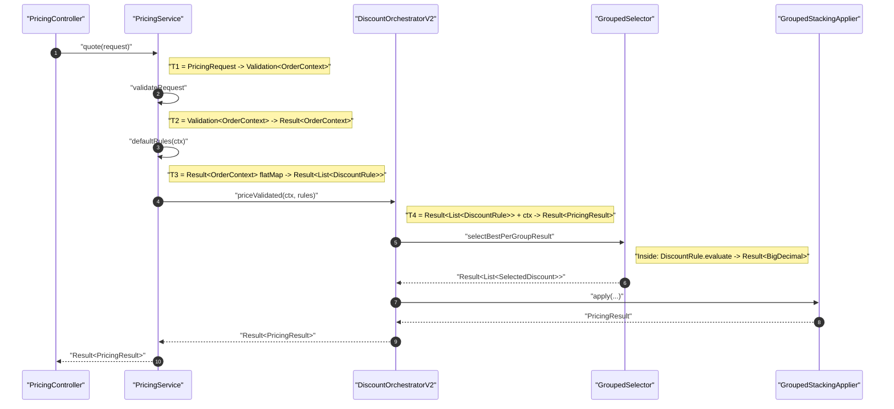

# Result Generic Sequence

```mermaid
sequenceDiagram
    autonumber
    participant API as "PricingController"
    participant SVC as "PricingService"
    participant ORCH as "DiscountOrchestratorV2"
    participant SEL as "GroupedSelector"
    participant APP as "GroupedStackingApplier"

    API->>SVC: "quote(request)"
    Note right of SVC: "T1 = PricingRequest -> Validation<OrderContext>"
    SVC->>SVC: "validateRequest"
    Note right of SVC: "T2 = Validation<OrderContext> -> Result<OrderContext>"

    SVC->>SVC: "defaultRules(ctx)"
    Note right of SVC: "T3 = Result<OrderContext> flatMap -> Result<List<DiscountRule>>"

    SVC->>ORCH: "priceValidated(ctx, rules)"
    Note right of ORCH: "T4 = Result<List<DiscountRule>> + ctx -> Result<PricingResult>"

    ORCH->>SEL: "selectBestPerGroupResult"
    Note right of SEL: "Inside: DiscountRule.evaluate -> Result<BigDecimal>"

    SEL-->>ORCH: "Result<List<SelectedDiscount>>"
    ORCH->>APP: "apply(...)"
    APP-->>ORCH: "PricingResult"
    ORCH-->>SVC: "Result<PricingResult>"
    SVC-->>API: "Result<PricingResult>"
```
