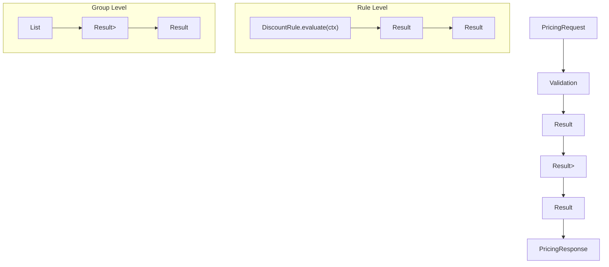

# Result Generic Type Flow

```mermaid
flowchart TD
    A["PricingRequest"] --> B["Validation<OrderContext>"]
    B --> C["Result<OrderContext>"]
    C --> D["Result<List<DiscountRule>>"]
    D --> E["Result<PricingResult>"]
    E --> F["PricingResponse"]

    subgraph "Rule Level"
      R1["DiscountRule.evaluate(ctx)"] --> R2["Result<BigDecimal>"]
      R2 --> R3["Result<SelectedDiscount>"]
    end

    subgraph "Group Level"
      G1["List<DiscountRule>"] --> G2["Result<List<SelectedDiscount>>"]
      G2 --> G3["Result<PricingResult>"]
    end
```
