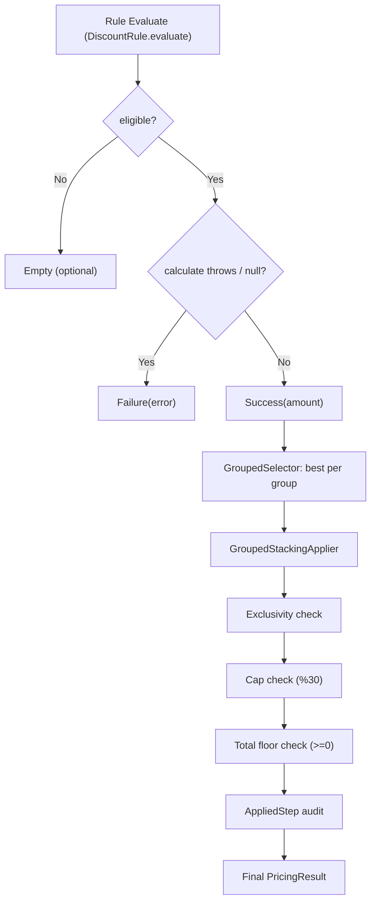

# Rule Evaluation Flow

```mermaid
flowchart TD
    A["Rule Evaluate (DiscountRule.evaluate)"] --> B{"eligible?"}
    B -- "No" --> E["Empty (optional)"]
    B -- "Yes" --> C{"calculate throws / null?"}
    C -- "Yes" --> F["Failure(error)"]
    C -- "No" --> D["Success(amount)"]

    D --> G["GroupedSelector: best per group"]
    G --> H["GroupedStackingApplier"]
    H --> I["Exclusivity check"]
    I --> J["Cap check (%30)"]
    J --> K["Total floor check (>=0)"]
    K --> L["AppliedStep audit"]
    L --> M["Final PricingResult"]
```
